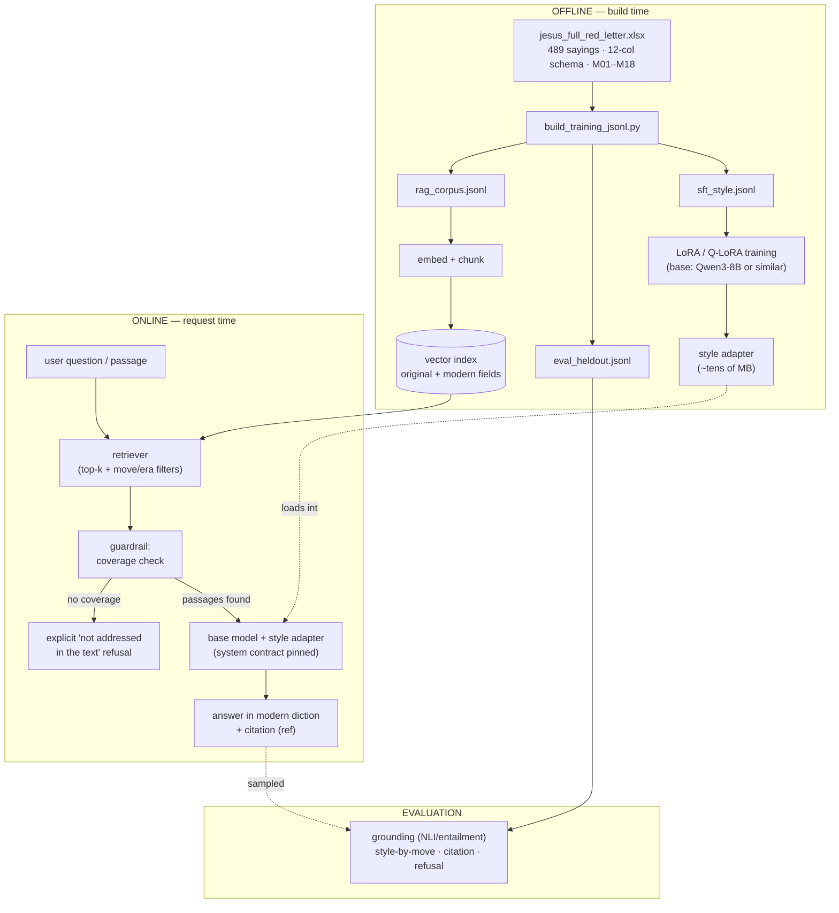

# Architecture — Jesus Digital Twin (RAG + LoRA Hybrid)

A reference design for a study aid that renders the recorded teachings of Jesus
in present-day English, preserving his reasoning patterns and diction, **without
inventing words he did not say.** It pairs a fine-tuned *style* adapter with a
*retrieval* layer that does the grounding. This document covers the components,
the data and request flow, model/tooling choices, evaluation, and guardrails.

The core principle (carried from the feasibility analysis): **fine-tuning is for
form, retrieval is for content.** The LoRA learns voice and the M01–M18 reasoning
moves; the RAG index supplies the actual cited text. Neither component is asked to
do the other's job, which is what keeps the system from fabricating scripture.

---

## 1. System diagram

---

## 2. Components

**Base model.** A strong open-weight instruct model. Qwen3-8B is a reasonable
default (mature tooling, runs a LoRA in <30GB VRAM, supports the OpenAI-style chat
format the data uses), but the design is model-agnostic — Llama, Mistral, or Gemma
of comparable size are drop-in. Choose by license, language quality, and where you
intend to host.

**Style adapter (LoRA / Q-LoRA).** Trained only on `sft_style.jsonl`. Learns the
ancient→modern transform and the rhetorical moves. Small, swappable, and leaves the
base weights intact — you can ship multiple registers (plain / formal /
conversational) as separate adapters.

**Retriever + vector index.** Built from `rag_corpus.jsonl`. Embeds both the
original WEB text and the modern rendering so queries in either register hit. Stores
`ref`, `move`, `audience`, `era` as metadata for scoped retrieval. This is the
component that owns *truth* — every served claim must trace to a retrieved passage.

**Coverage guardrail.** Before generation, check that retrieval returned passages
above a relevance threshold. If not, the system returns an explicit "the recorded
teachings don't address that" rather than letting the adapter improvise. This single
gate is the difference between a study aid and a fabrication engine.

**Serving runtime.** Base model + adapter behind an OpenAI-compatible endpoint, with
the **fixed system contract pinned** (identical to the training system prompt) so the
learned behavior reproduces at inference.

---

## 3. Request flow

1. User asks a question or submits a passage to modernize.
2. Retriever pulls top-k sayings (optionally filtered by move/era/audience).
3. Coverage guardrail decides: grounded answer, or principled refusal.
4. If grounded, the base+adapter model renders an answer in modern diction, in the
   retrieved saying's reasoning move, **with the citation carried through**.
5. A sampled fraction of live answers is logged to the eval harness.

The model never speaks from parametric memory alone — retrieved text is always in
context, and the answer must be supported by it.

---

## 4. Where to fine-tune — hosted vs. local

| | Alibaba Model Studio / DashScope | Local (Unsloth / PEFT / Axolotl) |
|---|---|---|
| Setup effort | Low — HTTP API, upload JSONL | Moderate — own GPU/box |
| Data privacy | Corpus + prompts leave your machine | Fully local |
| Cost at this scale | Pay per job | One GPU, hours |
| Adapter portability | Tied to platform serving | You hold the weights |
| Fit for this project | Fine for a quick first pass | **Recommended** — small dataset, public-domain text, full control |

Both consume the identical `sft_style.jsonl`, so you can prototype on Model Studio
and move local later (or vice versa) without reshaping data. Given the corpus is
small and public-domain, local LoRA is the better default; reach for the hosted path
only if you want zero infra setup.

---

## 5. Evaluation (the part that determines whether it's trustworthy)

Run on `eval_heldout.jsonl`, faceted by Reasoning Move:

- **Grounding / no-fabrication** — every output must be entailed by its source line
  (NLI or LLM judge). Hard failure otherwise. This is the top metric.
- **Style fidelity by move** — embedding similarity + judge vs. held-out modern
  rendering, per M01–M18, to expose which moves the adapter flattens.
- **Citation integrity** — correct `ref` surfaced.
- **Refusal behavior** — adversarial out-of-corpus prompts must trigger refusal,
  not confident paraphrase.

Gate releases on grounding and refusal, not on style alone. A fluent twin that
fabricates is worse than a stiff one that cites.

---

## 6. Guardrails and framing

- **Public-domain text only** (WEB) keeps the corpus and outputs clean.
- **Always cite.** Outputs name the passage; this also lets users verify.
- **Frame honestly.** Present it as *a study aid that modernizes recorded sayings*,
  not as the literal voice or opinions of Jesus on novel topics. Out-of-corpus
  questions get a refusal by design.
- **No new doctrine.** The architecture structurally prevents the model from
  generating teachings absent from the source; keep it that way — resist any later
  "just let it answer freely" shortcut, which collapses the grounding guarantee.

---

## 7. Build order

1. **Finish annotation** of `Modern Rendering` + `Reasoning Move` on the 489 sayings
   (this is the real bottleneck — everything downstream waits on it).
2. Run `build_training_jsonl.py` → SFT / eval / RAG files.
3. Stand up the **RAG layer first** and ship a grounded, base-model-only version.
   This alone is useful and safe.
4. Train the **style LoRA**; A/B it against base+RAG on the eval harness.
5. Keep the LoRA **only if** it improves style-by-move without hurting grounding —
   the same "if and only if it's better" test that started this project.
